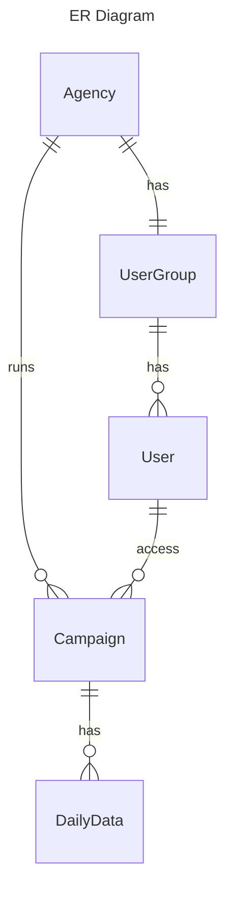
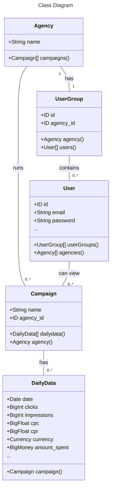
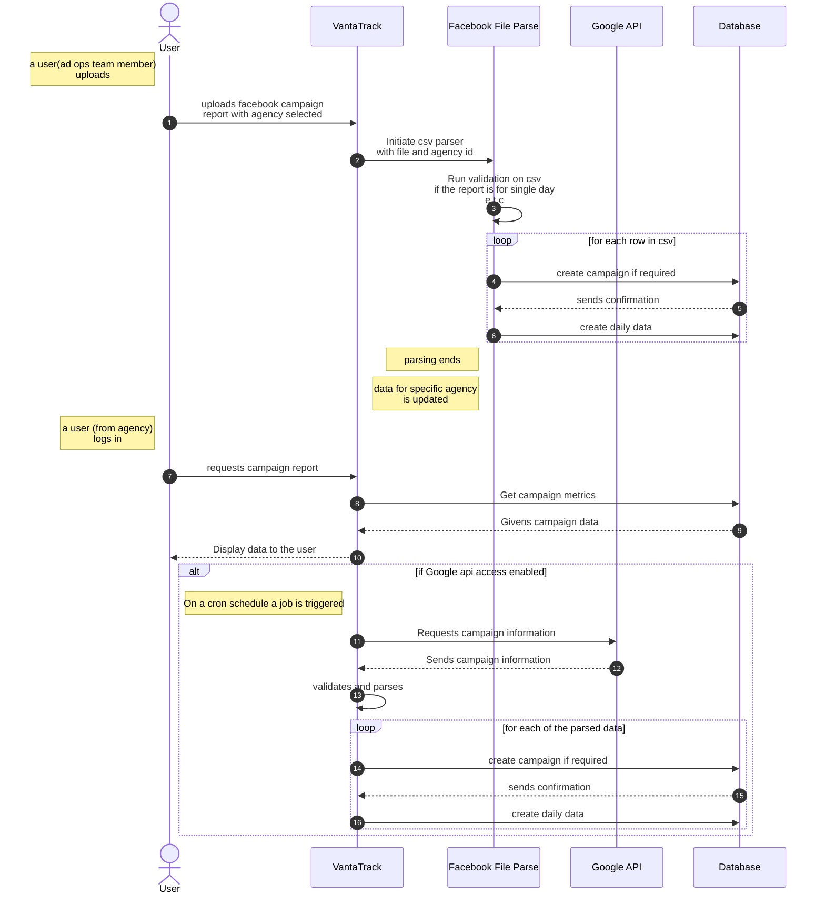

# Data Ingestion Pipeline - VantaTrack

# Table of contents
- [Context](#context)
- [Data Ingestion Process](#data-ingestion-process)
- [Data modeling](#data-modeling)
  - [ER Diagram](#er-diagram)
  - [Class Diagram](#class-diagram)
- [Benefits](#benefits)

# Context
VantaTrack currently manages a number of agencies to manage their digital campaigns in different social media platforms (i.e. Facebook, Google, e.t.c). 

The main challenge, currently faced by the organization is to show different metrics and spending to their customers (agency). Solving this would help gaining confidence from the customers (agency) and bring in transperancy in terms of reporting.

We can divide the challenges into two parts. 
- Ingesting data from different social media platform.
- Displaying the metrics and spending to the customers (agency)

This document will aim in solving the above two issues and also propose a sustainable way in scaling the application in future.

# Data Ingestion process
As VantaTrack is running campaigns on behalf of the agencies mainly in two platforms (Facebook, Google), to keep the scope of the document small, we will only discuss about data ingestion from Facebook. Other platforms would follow the same if no api integration is possible.

Data from the Facebook Ad platform can be found under `Ads Reporting` tab. Once there, a report can be generated for all the campaigns running under a single ad account. Reports can be generated in a pivot table. If we select `Campaign name` only instead of the account name, we would be able to export the reports in csv with desired information. In this case, care needs to be taken to uncheck the `Include summary row` during the report export. Once the report is downloaded, the format would be like the following.

| Campaign name	| Reach	| Impressions	| Frequency	| Currency |	Amount spent (USD) |	Attribution setting	| Reporting starts |Reporting ends|
|------|------|------|------|------|------|------|------|------| 
Summer Sale - Fashion - $50 - Aug	| 2,500	|3,750 |1.5 |	USD	| 45.32	7-day click or 1-day view | 2025-08-06 | 2025-08-06
Back to School - Leads - $100	| 5,630	| 7,890	| 1.4	| USD	| 98.45 | 7-day click or 1-day view| 2025-08-06	2025-08-06 |

# Data modeling
Since the format of campaign data is knowns, let's redirect our discussion towards data modeling. The data modeling should be centered towards our business needs not on the storage format. 

This would help us using the data model in our design conversation and expand on features without thinking about technical constraint on the storage layer. If needed, the data model would be translated into a storage model. In most cases, we would try to avoid that. 

If we look into the requirements, we can find these:
* An `Agency` is the customer of VantaTrack.
* An agency can run multiple `Campaign`s.
* A campaign can have data based on the date. Typically by day. Let's call this as `DailyData`. 
* An agency can have multiple user who can login. Let's call this `User`.

For the purpose of data ingestion there's no need of modeling the users. A sample ERD would look like the following.
## ER Diagram

## Class Diagram

Please do consider that no all the fields that needs to be stored are not mentioned here. This is just to give an idea what it might look like.

Another thing to notice that though the class diagram and the ERD looks similar, the distinction lies in ER diagram is for the storage layer and the class diagram is for business/domain logic. Keeping this separate would help us expanding the featuresets independent of each other.

# Sequence diagram for data ingestion

# Benefits 
* Keeping the data ingestion pipeline separate would help us onboarding new platform without making changes to a centralized data format.
* The data storage can evolve with different platform integration making the system decoupled.
* Granular level access for the users on any campaign is possible.